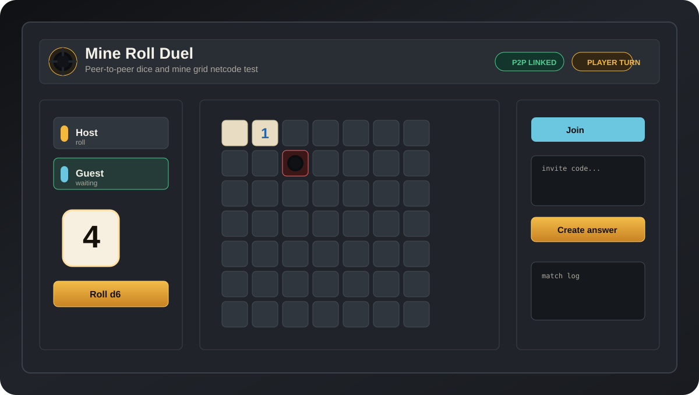
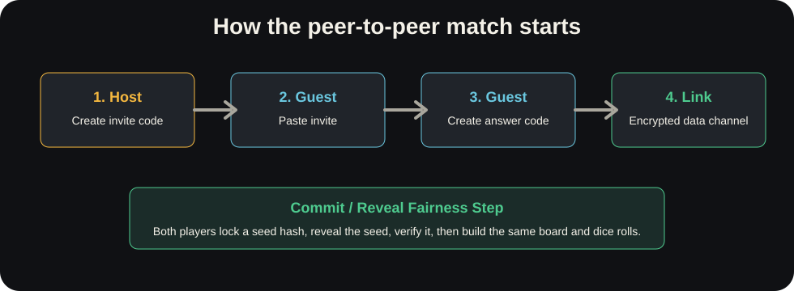

# Mine Roll Duel

<p align="center">
	
</p>

<p align="center">
	<strong>A local-file, two-player, peer-to-peer netcode test game.</strong><br>
	Open one HTML file, exchange invite/answer codes, roll a d6, and survive a 7 by 7 mine grid.
</p>

<p align="center">
	
	
	
	
</p>

## Play Online

When the GitHub Pages site is published, players can open the game here:

<p align="center">
	<a href="https://giagos.github.io/My_Net_Code_Test_Game/" target="_blank"><strong>Play Mine Roll Duel</strong></a>
</p>

If that link says **There isn't a GitHub Pages site here**, the game has not been published yet. That is not a player problem. The repository owner must enable GitHub Pages first, or players can use **Download And Open** below.

### Fix The GitHub Pages 404

Use the simple branch setup first. This project is a static site, so GitHub can publish it directly from the repository root.

1. Commit and push the latest files to `main`.

	```bash
	git add .
	git commit -m "Publish Mine Roll Duel"
	git push origin main
	```

2. On GitHub, open this repository.
3. Go to **Settings** > **Pages**.
4. Under **Build and deployment**, set **Source** to **Deploy from a branch**.
5. Set **Branch** to `main` and the folder to `/ (root)`.
6. Click **Save**.
7. Wait until GitHub shows a green success message or **Your site is live at...**.
8. Open `https://giagos.github.io/My_Net_Code_Test_Game/`.

If it still shows 404 after a few minutes:

- Check that the URL is exactly `https://giagos.github.io/My_Net_Code_Test_Game/`.
- Check that [index.html](index.html) is in the repository root on GitHub.
- Check that the repository is public, or that your GitHub plan allows Pages for private repositories.
- Open the repository **Actions** tab and check for a failed Pages build.
- If you choose **GitHub Actions** as the Pages source instead, run the **Deploy GitHub Pages** workflow and wait for a green check.

GitHub README files cannot run the game by themselves. GitHub removes scripts from README content for security, so the README button can only link to the hosted page.

## Purpose

Mine Roll Duel was created as a test project for experimenting with browser peer-to-peer netcode without a traditional hosted game server. It is made to be easy to download, inspect, run, and modify.

Created by **Giagkos Kapetankis**.

## Download And Open

1. Click the green **Code** button on GitHub.
2. Choose **Download ZIP**.
3. Extract the ZIP file.
4. Open [index.html](index.html) in a modern browser such as Chrome, Edge, or Firefox.

No install, build command, local web server, LAN setup, or router port forwarding is required for the files themselves.

## How To Play With A Friend

Both players need to open the same version of the game in a modern browser. The easiest way is for both players to use the GitHub Pages link after it is live. If the Pages link is still 404, both players can download the ZIP and open [index.html](index.html) locally.

You also need any chat app, voice call, or message window so the two players can send the invite and answer codes to each other.

### Player 1: Host

1. Open the game.
2. Type your name if you want.
3. Stay on the **Host** tab.
4. Click **Create invite**.
5. Click **Copy invite**.
6. Send the invite code to your friend.

### Player 2: Join

1. Open the game.
2. Click the **Join** tab.
3. Paste the invite code from Player 1.
4. Click **Create answer**.
5. Click **Copy answer**.
6. Send the answer code back to Player 1.

### Player 1: Finish Connecting

1. Paste the answer code into the **Answer code** box.
2. Click **Connect**.
3. Wait until both screens show **P2P linked**.
4. The match starts automatically.

After the match starts, the active player clicks **Roll d6**, then opens exactly that many closed tiles. If a bomb opens, that player loses the round. If all safe tiles are cleared, the active player wins.

Important connection tips:

- Send the whole invite or answer code. Do not edit it.
- Use a fresh invite and answer after reloading the page or changing the connection method.
- Try **STUN direct** first.
- If players are on different networks and it stays stuck, both players should use the same **TURN fallback** settings, click **Save Method**, then create a fresh invite and answer.
- If **Network Debug** shows `relay=0` and the connection never links, the TURN server was not used or did not work.

### Brave Browser Fix

Brave can block or hide WebRTC network routes to protect privacy. When that happens, the game may create an invite or answer, but **Network Debug** shows `sdpCandidates=0` or all candidate counts stay at `0`.

Fastest fix: ask the Brave player to try Chrome, Edge, or Firefox first. If the game links there, the problem is Brave privacy settings, not the game code.

If your friend wants to stay on Brave:

1. Open the game page in Brave.
2. Click the Brave lion icon in the address bar.
3. Turn **Shields** off for this site, or set fingerprinting protection to a less strict setting for this site.
4. Open `brave://settings/privacy`.
5. Find **WebRTC IP handling policy**.
6. Do not use **Disable non-proxied UDP** for this game.
7. Use **Default** or **Default public and private interfaces**.
8. Close private/Tor windows, VPNs, or firewall privacy tools while testing.
9. Reload both players' pages.
10. Create a fresh invite and answer.

Privacy tradeoff: allowing WebRTC routes can reveal network address information to the peer connection. For a game with a friend, that is normally acceptable; for maximum privacy, use **TURN relay only** with a trusted TURN server instead.

If Brave still does not link after those settings, both players should choose **TURN relay only**, enter the same TURN server details, click **Save Method**, reload, and create a fresh invite and answer. If **Network Debug** still shows `relay=0`, the TURN URL, username, credential, or provider is not working from that browser/network.

For a quick same-computer test, open [index.html](index.html) in two browser tabs and use the same host/join steps between the tabs.

## Game Rules

- The board is a 7 by 7 grid.
- Each round contains a random 1 to 6 hidden bombs.
- The active player rolls one d6.
- The roll decides exactly how many closed tiles that player must open.
- Opening a bomb loses the round.
- Clearing all safe tiles wins the round.
- **Local duel** starts a same-screen test match without WebRTC.

## Netcode Overview

<p align="center">
	
</p>

The game uses WebRTC data channels for peer-to-peer gameplay messages. The invite and answer text boxes are the manual signaling system: instead of using a matchmaking server, the players copy and paste the connection information themselves.

What happens under the hood:

1. The host creates a WebRTC offer and copies it as an invite code.
2. The guest pastes that invite, creates a WebRTC answer, and sends it back.
3. The host applies the answer, completing negotiation.
4. WebRTC opens an encrypted data channel between the two browsers.
5. Both players run a commit/reveal seed exchange.
6. The verified shared seed generates the same bombs, same first player, and same dice rolls on both machines.

The game uses public STUN servers so browsers can discover possible peer routes. STUN is not a game server and does not store match state. On very restrictive networks, browsers may require TURN relay infrastructure; that would be a server, so it is intentionally not included in this no-backend experiment.

## Internet Play And TURN

LAN play can work with direct local candidates. Internet play is less predictable because routers, mobile carrier NAT, VPNs, firewalls, and privacy settings can block direct WebRTC UDP routes.

The **Network Debug** panel shows the important clue:

- `host` candidates are local/private routes.
- `srflx` candidates are public STUN-discovered routes.
- `relay` candidates come from a TURN server.

If internet play gets stuck with `relay=0`, add a TURN relay. Both players should choose the same connection method and enter the same TURN details before creating a fresh invite and answer.

In the game:

1. Open **Connection Method**.
2. Choose **STUN direct**, **TURN fallback**, or **TURN relay only**.
3. For TURN modes, enter a server URL such as `turn:relay.example.com:3478`, `turn:relay.example.com:3478?transport=udp`, `turn:relay.example.com:3478?transport=tcp`, or `turns:relay.example.com:5349`.
4. Enter the TURN username and credential.
5. Click **Save Method**.
6. Create a fresh invite and answer.
7. In **Network Debug**, look for `relay>0` or an `ICE server error`.

The **Help** button in the method panel lists the accepted values. STUN direct locks the TURN fields because it does not use a URL, username, or credential. TURN modes require a URL beginning with `turn:` or `turns:` and no spaces; username and credential should match the exact values from the TURN provider.

Method guide:

- **STUN direct**: no relay. Best for LAN and easy home networks.
- **TURN fallback**: tries direct routes first, then a relay if needed. Best normal internet setting.
- **TURN relay only**: forces all traffic through TURN. Best for testing if TURN works or for strict networks.

Ways to get TURN credentials:

- Use a hosted TURN provider such as Metered, Twilio, Xirsys, or similar.
- Self-host `coturn` on a VPS with UDP/TCP port `3478`, and optionally TLS on `5349`.

Do not put private TURN passwords directly into the source code for a public repository. The in-game TURN form stores them only in the current browser's local storage.

## Project Structure

```text
index.html          Browser entry point
styles.css          Layout, board visuals, responsive UI, animations
assets/             SVG icons and README images
js/config.js        Shared constants such as grid size and STUN servers
js/state.js         Central game and connection state
js/utils.js         Hashing, random seed helpers, code encoding, small utilities
js/rules.js         Board generation, neighbor counts, deterministic dice rolls
js/netcode.js       WebRTC offer/answer, data channel, messages, seed exchange
js/game.js          Turn rules, tile opening, win/loss logic, action validation
js/ui.js            DOM rendering, controls, board drawing, result screens
js/main.js          Startup wiring
```

## Security And Fairness Notes

- WebRTC data channels are encrypted by the browser with DTLS.
- The board and dice are created from both players' random seeds.
- The commit/reveal step prevents one player from choosing the board after seeing the other player's seed.
- This is casual-secure, not cheat-proof. A player can always edit their own local files or browser runtime.

## Developer Testing Checklist

Use this when changing the code:

1. Open [index.html](index.html) directly from the file system.
2. Click **Local duel**, roll, and open tiles until the turn changes.
3. Reload and open a second tab.
4. Run the host/join invite flow between the two tabs.
5. Confirm both tabs show the same bomb count and round number.
6. Roll and open one tile on the active tab.
7. Confirm the other tab mirrors the roll and opened tile.

## License

See [LICENSE](LICENSE).